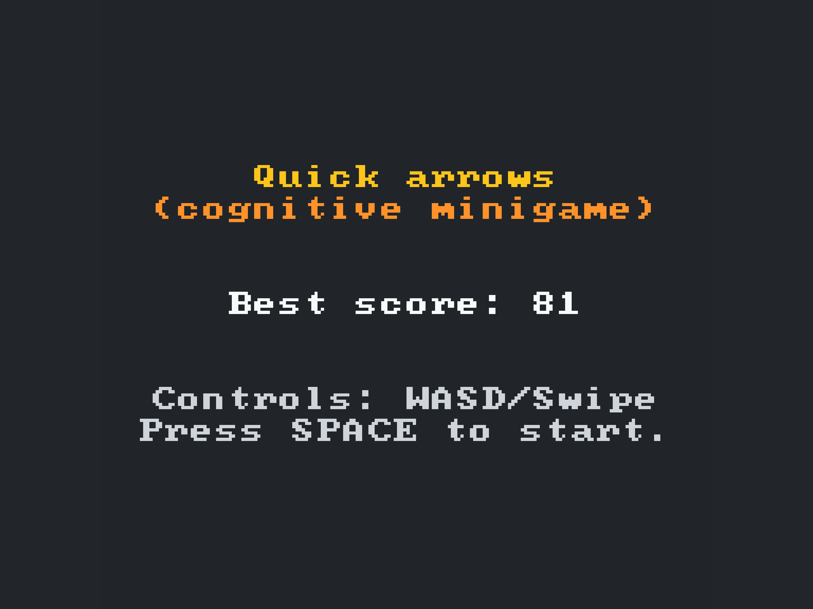
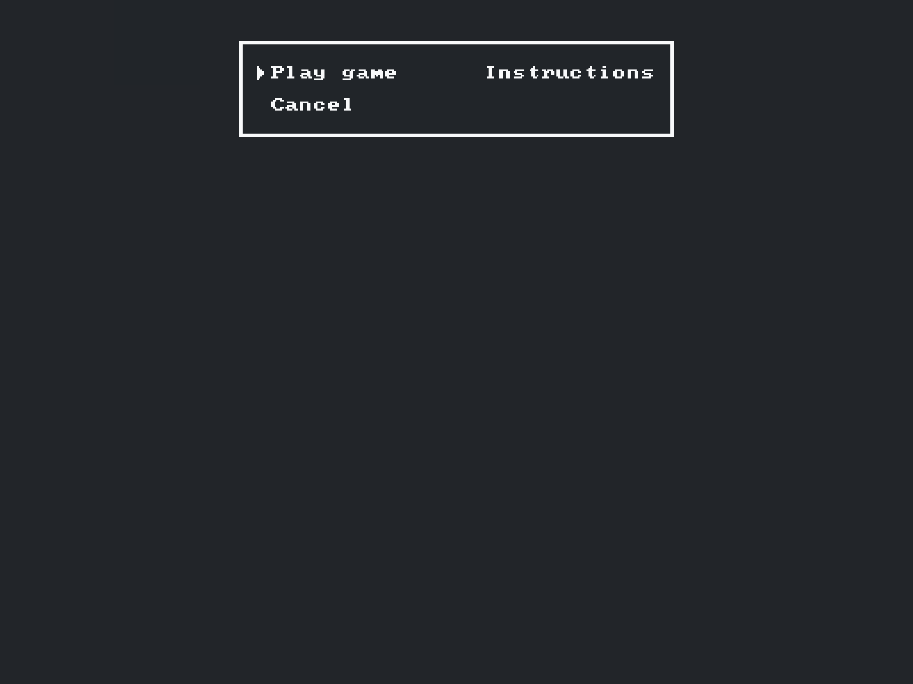
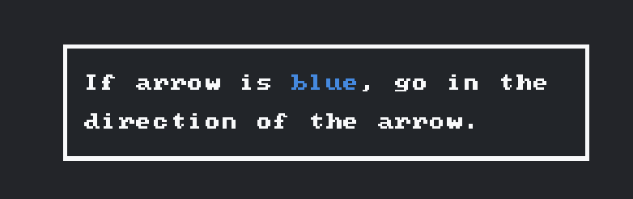
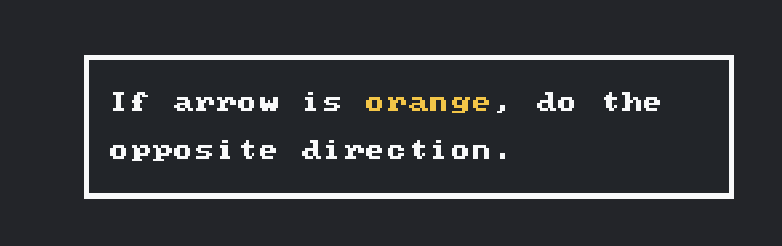
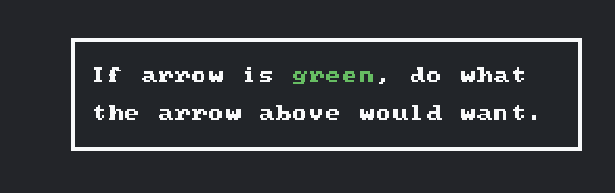
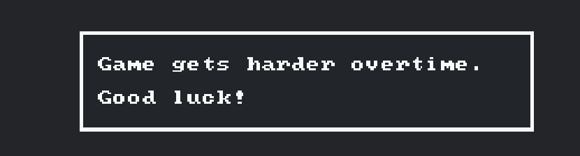
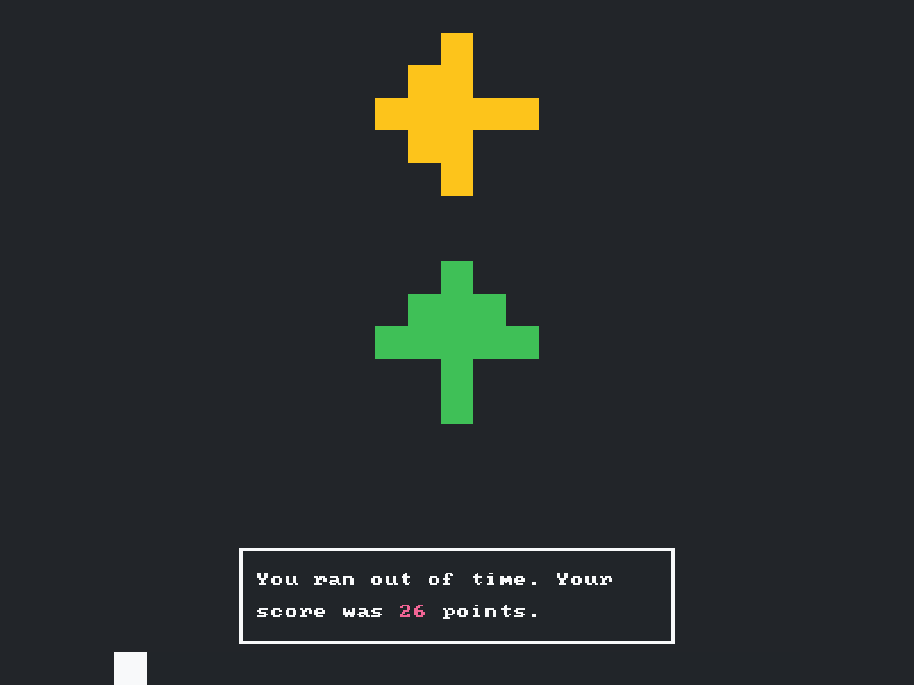

# Quick Arrows 🎯

**A cognitive brain training minigame that challenges your reaction time and mental agility.**

Quick Arrows is an engaging brain training game that tests your ability to quickly process visual information and make split-second decisions. The game progressively increases in difficulty, making it perfect for improving cognitive flexibility and reaction speed.

🎮 **[Play Online](https://quick-arrows.appwrite.network/)**

## 🎯 Game Concept

- **Progressive Difficulty**: Game becomes more challenging as you improve
- **High Score Tracking**: Your best score is saved locally
- **Responsive Design**: Works on both desktop and mobile devices
- **Visual Timer**: Color-coded timer bar shows remaining time
- **Clear Instructions**: Built-in tutorial explains all game mechanics

## 🧠 How to Play

The goal is simple: respond to arrows by pressing the correct direction key (WASD) or swiping on mobile devices. But here's the twist - the color of the arrow determines what action you need to take:

### Arrow Rules

- **🔵 Blue Arrow**: Press the direction the arrow is pointing
- **🟠 Orange Arrow**: Press the OPPOSITE direction of where the arrow is pointing
- **🟢 Green Arrow**: Look at the arrow above and respond as if that arrow were blue or orange

### Controls

- **Desktop**: Use WASD keys (W=Up, A=Left, S=Down, D=Right)
- **Mobile**: Swipe in the correct direction

## 🏆 Difficulty Levels

- Each correct response earns you 1 point
- The game starts easy but gets progressively harder as your score increases
- Timer speed increases with higher scores
- Arrow color distribution becomes more challenging over time
- **Score of 100+ is considered excellent performance**

## 🧠 Memory Training Benefits

Forest Hike helps improve:
- **Spatial Memory**: Remembering layouts and paths
- **Visual Memory**: Recalling map details and landmarks
- **Working Memory**: Holding information while navigating
- **Attention to Detail**: Noticing important path markers
- **Sequential Memory**: Remembering the order of turns and directions

## 🛠️ Technical Details

Quick Arrows is built using:
- [Odyc.js](https://odyc.dev/) - A lightweight JavaScript game framework
- Pure JavaScript

### Project Structure

```
quick-arrows/
├── index.html          # Main HTML file
├── assets.js           # Game sprites and configuration
├── scenes/             # Game scenes
│   ├── welcome.js      # Welcome screen
│   ├── menu.js         # Main menu
│   ├── instructions.js # Tutorial/instructions
│   └── game.js         # Main game logic
├── utils/              # Utility classes
│   ├── arrows.js       # Arrow generation and logic
│   └── timer.js        # Game timer system
└── screenshots/        # Game screenshots
```

### 🚀 Local Development

1. Clone this repository
2. Start HTTP server `npx http-server`
3. Visit `http://localhost:8080`

## 🖼️ Screenshots

| Welcome screen | Menu |
|------|---------------------|
|  |  |

| Instructions (1) | Instructions (2) |
|--------------|------------------|
|  |  |

| Instructions 3 | Instructions 4 |
|--------------------|------------|
|  |  |

| Game screen |
|---------------------|
|  |

## 📄 License

This project is licensed under the MIT License - see the [LICENSE](LICENSE) file for details.

## 🤝 Contributing

Contributions are welcome! Feel free to:
- Report bugs
- Suggest new features
- Submit pull requests
- Improve documentation

---

**Ready to test your reflexes? [Start playing now!](https://quick-arrows.appwrite.network/)**